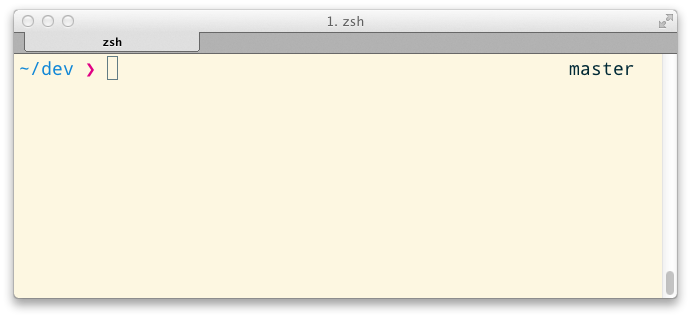

# Pure

> Pretty, minimal and fast ZSH prompt



### Changes from the original repo

- Removed `precmd` (leave only `vsc_info`) and `preexec` hooks
- Add right prompt (love it) and move branch name there
- Disable other vcs for speed
- Add more hints for setting up prompt

## Getting started

- Clone this repo, add it as a submodule, or just download `pure.zsh`.

- Symlink `pure.zsh` to somewhere in [`$fpath`](http://www.refining-linux.org/archives/46/ZSH-Gem-12-Autoloading-functions/) with the name `prompt_pure_setup`.

Example:

```sh
$ ln -s "$PWD/pure.zsh" /usr/local/share/zsh/site-functions/prompt_pure_setup
```
*Run `echo $fpath` to see possible locations.*

- Initialize the prompt system (if not so already):

```sh
# .zshrc
autoload -U promptinit && promptinit
```

- Choose this prompt:

```sh
# .zshrc
prompt pure
```

## Tip

In the screenshot above you can see [Solarized Light](http://ethanschoonover.com/solarized) theme with the [Droid Sans Mono](http://www.google.com/webfonts/specimen/Droid+Sans+Mono) font.

## License

MIT © [Sindre Sorhus](http://sindresorhus.com)
with changes by [Max Prokopiev](http://maxprokopiev.com)
